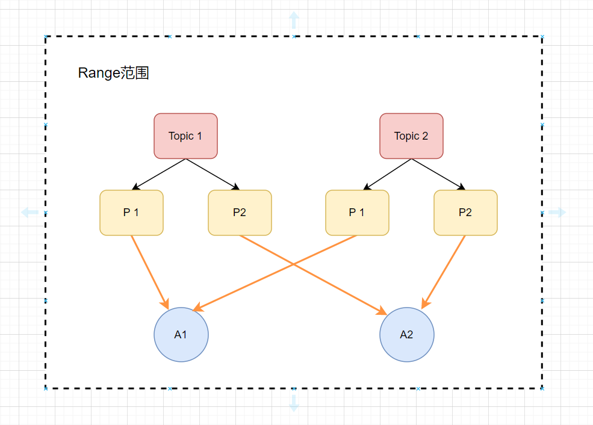
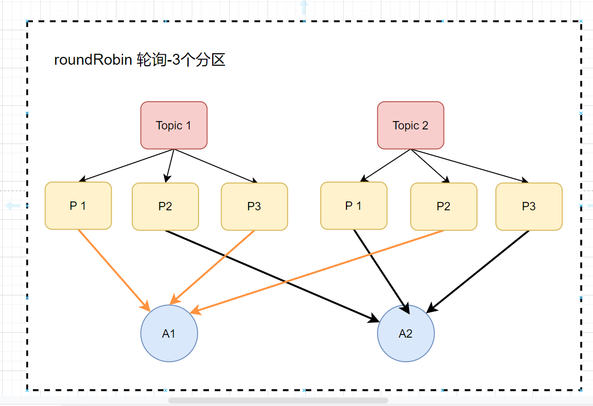

# 前言

> 本文主要讲解了Kafka的分区分配策略

# Kafka的分区分配策略

Kafka的分区分配策略主要有3种，分别为：

1. range范围（默认）
2. roundRobin 轮询
3. sticky粘性

## range范围（默认）

它是Kafka默认的一种分配方式，它的原理是把消费者总数和分区总数做一个整除运算，来进行一个平均分配，它会把消费者组内，所有订阅这个Topic的消费者按照一个
字典序排序，然后把这些分区，平均的分配给消费者，如果它有余数的话，那么它将会把字典数排序靠前的消费者多分配一个分区。 举个例子： 有两个topic(Topic1,Topic2)
,有两个消费者（A1，A2），每个主题上有2个分区，具体的分配策略如下：

这样一看，我们感觉它分配的也均匀。但是这个均匀会一直这样下去吗？或者说在任何情况下都能分配均匀吗？我们再来看另一种情况： 有两个topic(Topic1,Topic2),有两个消费者（A1，A2），每个主题上有3个分区，具体的分配策略如下：

很明显可以看到，这个分配方式是不均匀的，如果说这种情况再进行一个扩大，很可能会造成消费者压力过大。

## roundRobin 轮询

实现原理：它是把消费者组内所有的消费者以及消费者所订阅的Topic都进行字典排序，然后通过轮询的方式逐个的把这些分区，分配给每个消费者，如Kafka分区分配策略_roundRobin轮询_3个分区 所示：

如上所示，每个消费者消费的分区都是相同的，但是这仅仅在它两个都订阅了这两个topic，在消费者订阅的topic相同的情况下，他才能进行一个均匀的分配，如果说它订阅的 不相同的话，它会怎么样呢？

如下所示：有两个topic(Topic1,Topic2，Topic3),有3个消费者（A1，A2，A3），每个主题上的分区如下，比如：

- A1订阅了Topic1
- A2订阅了Topic1,Topic2
- A3订阅了Topic1,Topic2,Topic3

具体的分配策略如下：

## sticky粘性

粘性分区分配策略，它主要有两个目的：

1. 分区分配尽可能地要均匀
2. 分区分配要尽可能的跟上次保持相同（主题分区尽可能地保留在其先前分配的消费者中）

粘性分区分配策略是从Kafka 0.11.x版本之后引进的，如果两个目的发生冲突了，分区分配均匀这个目的要优先于保持相同这个目的 如下所示：有两个topic(Topic1,Topic2，Topic3)
,有3个消费者（A1，A2，A3），每个主题上的分区如下，比如：

- A1订阅了Topic1
- A2订阅了Topic1,Topic2
- A3订阅了Topic1,Topic2,Topic3

采用粘性策略的分配如下：

可以看到，这就是一个最优的解了，A1订阅了Topic1所以它消费了Topic1，A2订阅了Topic1,Topic2因为Topic1已经被消费了，所以A2消费Topic2的消息，同理A3
消费了Topic3的消息。

这样分配是比较合理的，但是此时，突然有一个消费者脱离了消费者组，比如说A1挂掉了或者说它脱离了，那么此时它会怎样分配呢？

# 什么时候用到分区分配策略？

那我们什么时候要用到这个分区分配策略呢？ 主要有两点：

1. 一个消费者组，它里面的消费者进行新增或者减少的时候，它会进行一个重新分配，如果新增的话，它会把分区进行一个重新分配，如果减少的话，也会进行一个重新分配
2. topic分区发生变化的时候，也会进行重新分配