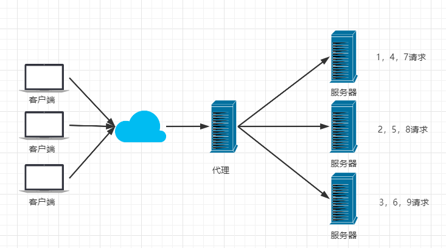
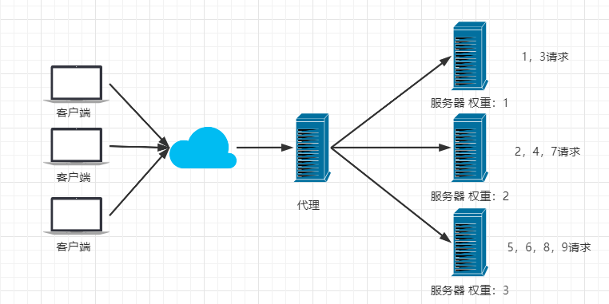
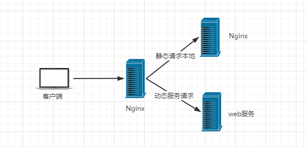

# 基本概念

Nginx (engine x) 是一个高性能的HTTP和反向代理web服务器，同时也提供了IMAP/POP3/SMTP服务。

# Nginx的作用

> Http代理，反向代理：作为web服务器最常用的功能之一，尤其是反向代理。

- 正向代理：代理了客户端
- 反向代理：代理了服务端

Nginx提供的负载均衡策略有2种：内置策略和扩展策略。内置策略为轮询，加权轮询，Ip hash。扩展策略，就天马行空，只有你想不到的没有他做不到的。

## nginx负载策略

1. 轮询

2. 加权轮询

加权轮询可以根据服务器资源的情况，有选择性的将请求打到资源相对好的服务器

3. iphash

iphash对客户端请求的ip进行hash操作，然后根据hash结果将同一个客户端ip的请求分发给同一台服务器进行处理，可以解决session不共享的问题。

## nginx动静分离

在软件开发中，有些请求是需要后台处理的，有些请求是不需要经过后台处理的（如：css、html、jpg、js等等文件），这些不需要经过后台处理的文件称为静态文件。让动态网站里的动态网页根据一定规则把不变的资源和经常变的资源区分开来，动静资源做好了拆分以后，我们就可以根据静态资源的特点将其做缓存操作。提高资源响应的速度。

# Nginx的安装不部署

## windows环境

## linux环境

# 参考文章

1. https://www.kuangstudy.com/bbs/1353634800149213186